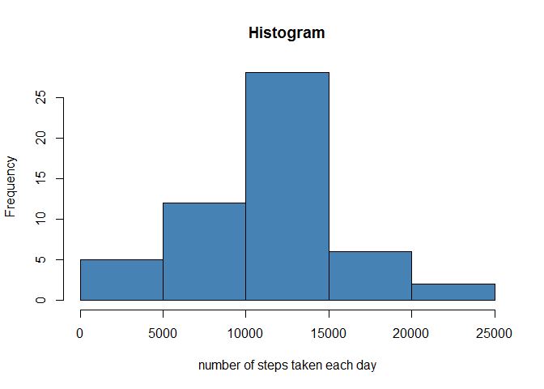
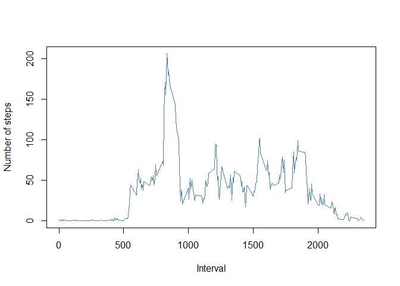
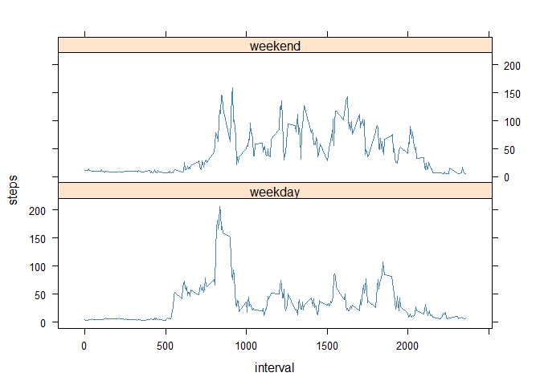

# Reproducible Research: Peer Assessment 1


## Loading and preprocessing the data


```r
#Unzip data
if (!file.exists("activity.csv")) { 
  unzip("activity.zip")
}
activity<-read.csv("activity.csv")
```


## What is mean total number of steps taken per day?

1. Calculate the total number of steps taken per day

```r
activity.data<-aggregate(steps~date,data=activity,sum,na.rm=TRUE)
```

2. Make a histogram of the total number of steps taken each day

```r
hist(activity.data$steps,col="steelblue",xlab="number of steps taken each day",main="Histogram")
```

<!-- -->

3. Calculate and report the mean and median of the total number of steps taken per day


```r
mean.activity<-round(mean(activity.data$steps,na.rm = TRUE),digits=2)
median.activity<-round(median(activity.data$steps,na.rm = TRUE),digits=2)
```

+ The mean is 10766.19 steps
+ The median is 10765 steps

## What is the average daily activity pattern?

1. Make a time series plot (i.e. type = "l") of the 5-minute interval (x-axis) and the average number of steps taken, averaged across all days (y-axis)

```r
activity.interval<-aggregate(steps~interval,data=activity,mean,na.rm=TRUE)
plot(y=activity.interval$steps ,activity.interval$interval ,type = "l",xlab = "Interval", ylab = "Number of steps",col="steelblue")
```

<!-- -->

2. Which 5-minute interval, on average across all the days in the dataset, contains the maximum number of steps?


```r
maxstep<-activity.interval$interval[which.max(activity.interval$steps)]
```
+ The 5-minute interval which maximum number of steps is: 835


## Imputing missing values

1. Calculate and report the total number of missing values in the dataset (i.e. the total number of rows with NAs)

```r
sum.na<-sum(is.na(activity$steps))
```
the total number of missing values: 2304


2. Devise a strategy for filling in all of the missing values in the dataset. The strategy does not need to be sophisticated. For example, you could use the mean/median for that day, or the mean for that 5-minute interval, etc.

I will use the means for the 5-minute intervals as fillers for missing values.

3. Create a new dataset that is equal to the original dataset but with the missing data filled in.


```r
# Index of missing data
index.na<-which(is.na(activity$steps))

# Interval of missin data
interval.na<-activity[index.na,][3]

# merge interval.na (Interval of missin data) with activity.interval (the means for the 5-minute)
interval.na<-merge(x = interval.na, y = activity.interval, by="interval", all.x=TRUE)

# Fill missing data
activity$steps[index.na]<-interval.na$steps
```

4. Make a histogram of the total number of steps taken each day and Calculate and report the mean and median total number of steps taken per day. Do these values differ from the estimates from the first part of the assignment? What is the impact of imputing missing data on the estimates of the total daily number of steps?


```r
activity.data<-aggregate(steps~date,data=activity,sum,na.rm=TRUE)
hist(activity.data$steps,col="steelblue",xlab="number of steps taken each day",main="Histogram")
```

<!-- -->


```r
mean.activity<-round(mean(activity.data$steps,na.rm = TRUE),digits=2)
median.activity<-round(median(activity.data$steps,na.rm = TRUE),digits=2)
```

+ The mean is 10766.19 steps. Is the same as the previous because i use the mean to fill 
+ The median is 11015 steps. Is diferent because i have new values

## Are there differences in activity patterns between weekdays and weekends?

1. Create a new factor variable in the dataset with two levels - "weekday" and "weekend" indicating whether a given date is a weekday or weekend day.


```r
library(lubridate)
```

```
## 
## Attaching package: 'lubridate'
```

```
## The following object is masked from 'package:base':
## 
##     date
```

```r
activity$weekday<-"weekday"
activity$weekday[which(wday(ymd(activity$date))==1)]<-"weekend"
activity$weekday[which(wday(ymd(activity$date))==7)]<-"weekend"
activity$weekday<-as.factor(activity$weekday)
table(activity$weekday)
```

```
## 
## weekday weekend 
##   12960    4608
```

2. Make a panel plot containing a time series plot (i.e. type = "l") of the 5-minute interval (x-axis) and the average number of steps taken, averaged across all weekday days or weekend days (y-axis). See the README file in the GitHub repository to see an example of what this plot should look like using simulated data.


```r
activity.interval.w<-aggregate(steps~interval+weekday,
                                  data=activity,
                                  mean,na.rm=TRUE)
library(lattice)
xyplot(steps~interval | weekday, data=activity.interval.w,layout=c(1,2),type="l",col="steelblue")
```

<!-- -->

